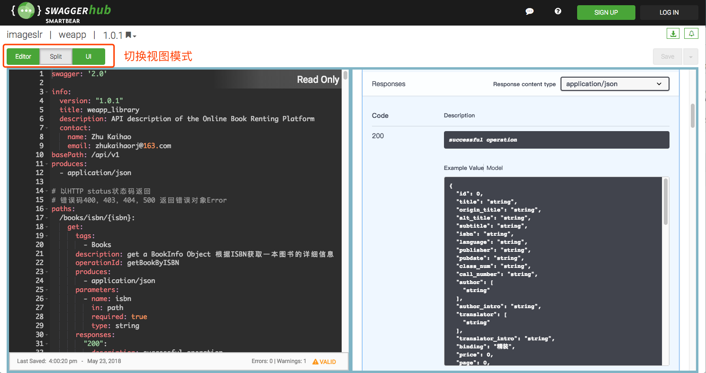
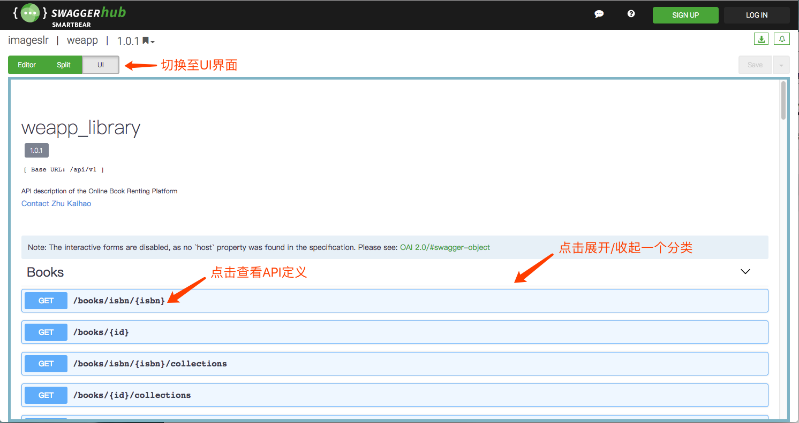
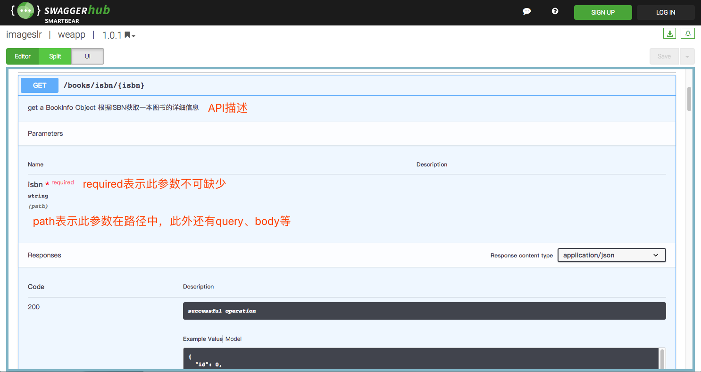
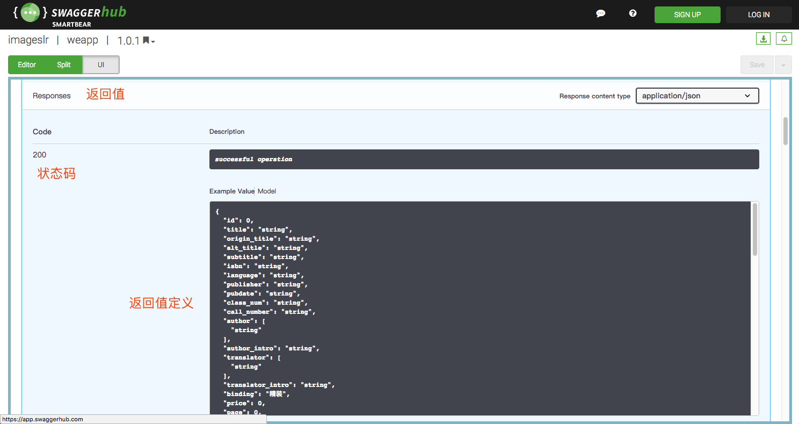
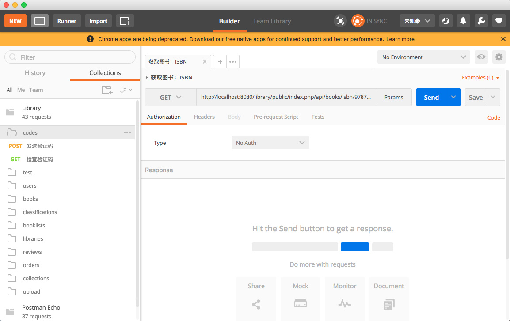

# API

:::tip
访问 [Swagger 文档](https://app.swaggerhub.com/apis/imageslr/weapp/1.0.1#/)可能需要科学上网
:::

本项目基于 RESTful 架构风格设计了规范的 API。利用 YAML 语言对接口路径、接口参数、参数约束、返回信息格式等作了详细定义，接口文档发布在[Swagger](https://app.swaggerhub.com/apis/imageslr/weapp/1.0.1#/)上；通过 Slim 框架实现服务器对 API 的路由。

本项目基于 API 文档实现了开发过程的前后端分离：前后端基于同一个 API 文档开发，前端通过 mock 网站获取假数据，后端利用 PostMan 工具模拟请求测试接口，开发完成后能够很快进行整合，无论是开发效率还是程序的可维护性都大大提高。

## 文档
本项目利用 YAML 语言对接口路径、接口参数、参数约束、返回信息格式等作了详细定义，接口文档发布在 Swagger 上，Swagger 是一个 REST API 文档生成工具。[点击这里查看文档](https://app.swaggerhub.com/apis/imageslr/weapp/1.0.1)，文档语法遵循[ OpenAPI 规范](https://github.com/OAI/OpenAPI-Specification/blob/master/versions/3.0.1.md)。

以下是对 Swagger 界面的介绍：









## 约定
### URL
* 用一级路径表示”资源“，如`https://api.example.com/users` 表示全部用户信息
* 为应对 API 变更的情况，将API的版本号放入URL，如`https://api.example.com/v1/`

### HTTP 动词
本项目主要使用以下三种请求方法：

* GET（SELECT）：从服务器取出资源（一项或多项）
* POST（CREATE/UPDATE）：在服务器新建/修改一个资源
* DELETE（DELETE）：从服务器删除资源

### 参数位置
* 路径`path`：如`id`
* url`query`：主要用于`GET`请求，如`start`，`count`
* 请求体`body`：主要用于`POST`请求，如修改个人信息时的提交内容
* 请求头`header`：如 `TOKEN`

### 数据格式
* 前端向服务器发送的数据、服务器返回的数据均为`JSON`格式
* 部分情况下（如上传图片）可以是`form-data`格式

### 状态码
本项目使用了以下几种状态码表示执行结果：

* 200：操作成功
* 201：创建资源成功
* 400：参数不合法（缺少必要参数或参数格式错误）
* 401：认证失败：token、用户名、密码错误
* 403：用户已登录，但是禁止访问
* 404：资源不存在
* 500：服务器内部错误

### 最佳实践
#### 对一级路径进行 GET 请求
返回数据资源的数组，如`GET /reviews`返回多条评论。前端可设置`start`与`count`，分别代表数据的偏移与返回数据的个数。

返回值定义如下，其中**模型数组的键名命名为对应 `Model` 类名的复数**（见[数据库与模型类-命名](back.md#数据库与模型类)）：

```JSON{2}
{
  "reviews": [], // 模型数组，对应模型类为 Review
  "start": 0, // 偏移量，默认 0
  "count": 20, // 获取个数，默认 20
  "total": 10297 // 数据总数
}
```

#### 对一级路径进行 POST 请求
表示向该资源添加数据，如`POST /users`表示添加一名用户。

#### 对二级路径进行 GET/POST/DELETE 请求
表示对一个特定的数据资源进行操作。如`GET /users/1`返回`id`为 1 的用户的信息；`POST /users/1`表示修改`id`为 1 的用户的信息；`DELETE /users/1`表示删除`id`为 1 的用户）

#### 其他
* 对于所有POST请求，服务器应返回修改后的数据资源
* 键名与 Model 类名一致，如`/collections`的返回值为馆藏对象，包含图书信息和图书馆信息，则其定义为：

```JSON{2-3}
{
  "book": {}, // 图书信息，对应 Model 类为 Book
  "library": {}, // 图书馆信息，对应 Model 类为 Library
  "available_num": 21, 
  "total_num": 10297 
  // ...
}
```

## 错误对象
对于所有状态码 ≥ 400 的错误响应，均返回一个错误对象，包含三个属性：错误码、给开发者看的错误信息和给用户看的错误信息。

```JSON
{
  "code": Integer, // 自定义错误码
  "message": String, // message for user 显示给用户的错误信息
  "err_msg": String // message for developer 显示给开发者的错误信息
}
```

## 测试工具
PostMan

