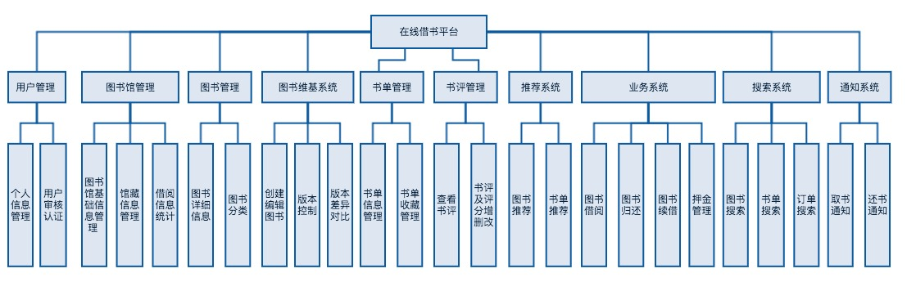
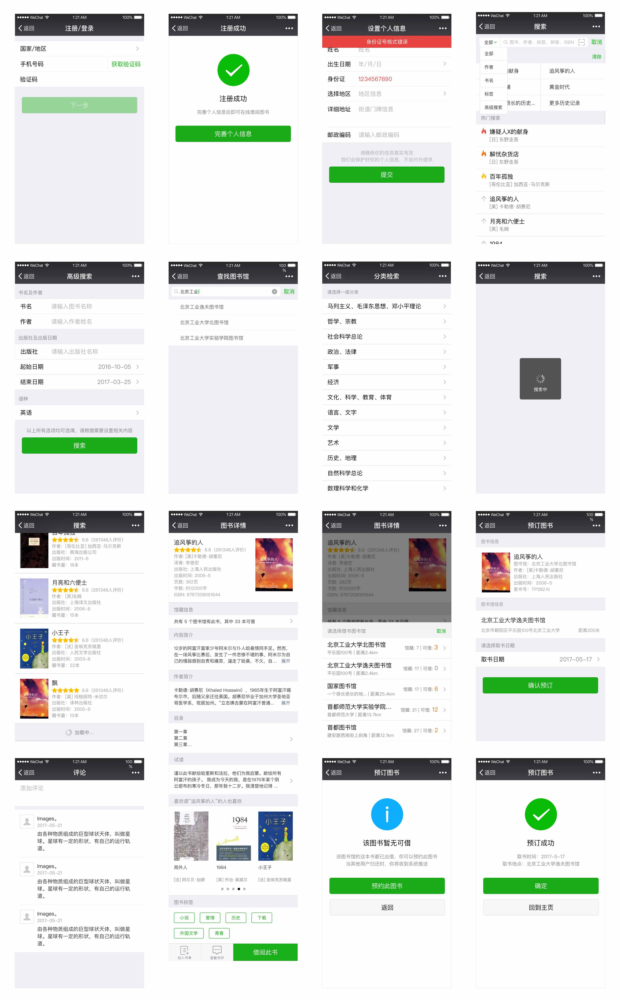
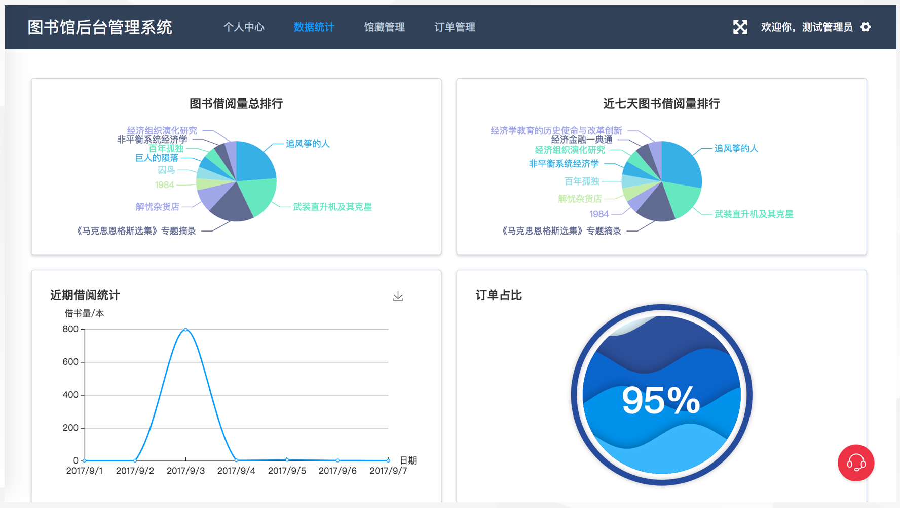
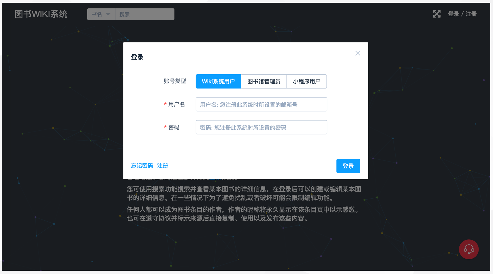
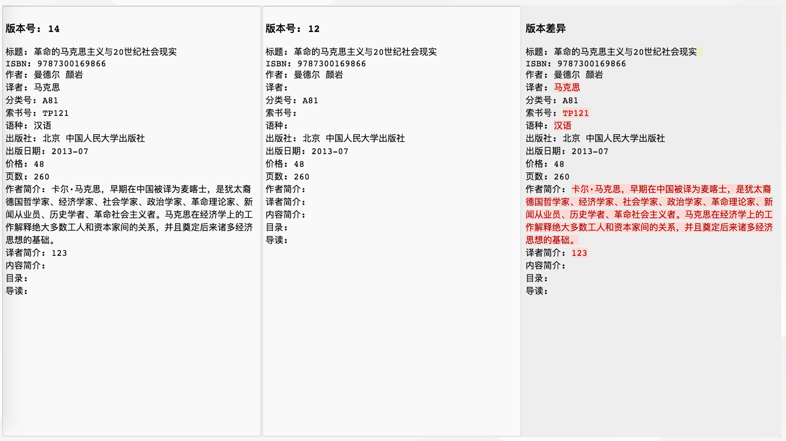
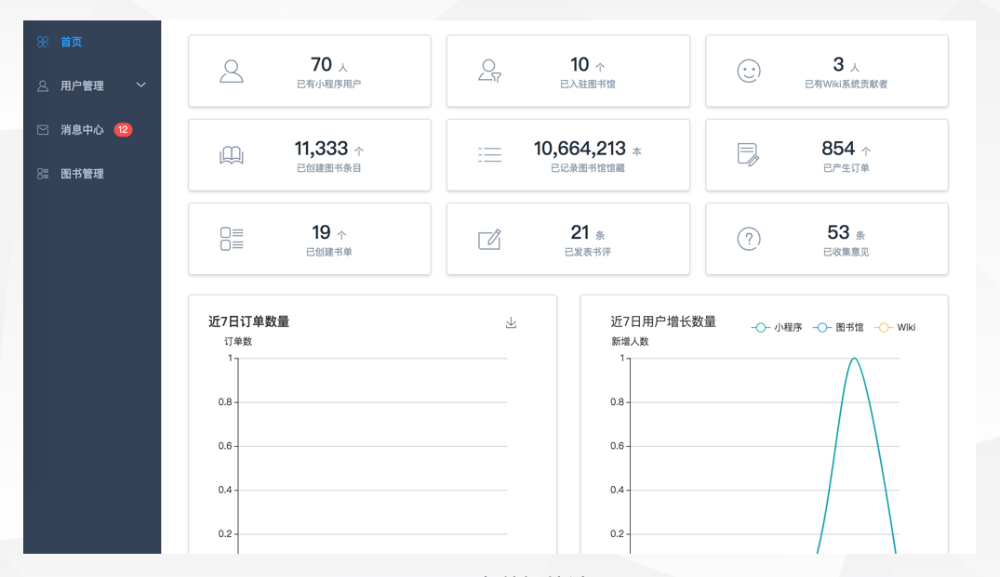
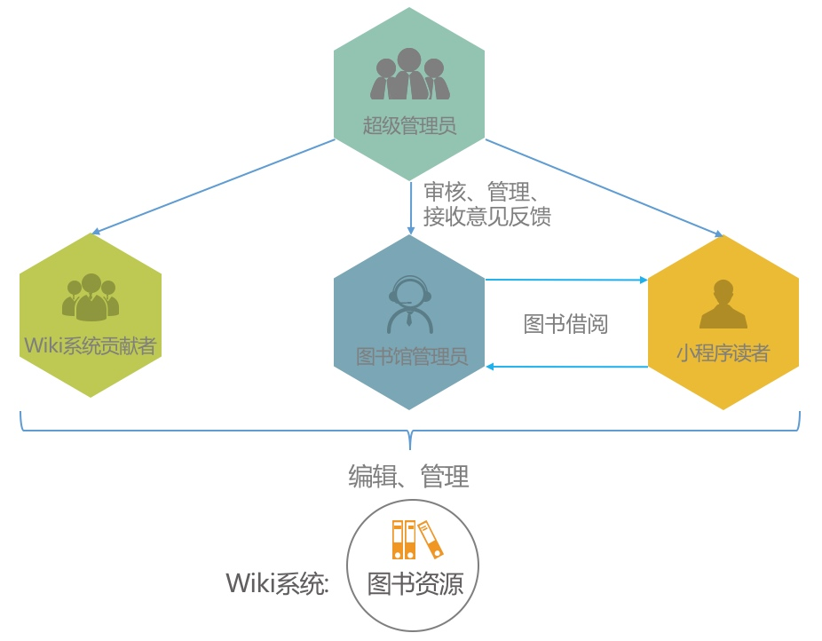
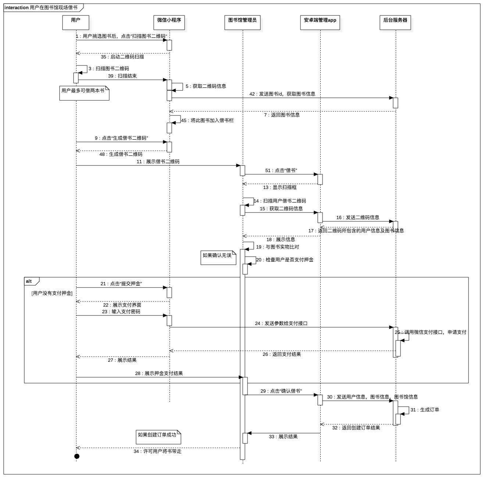
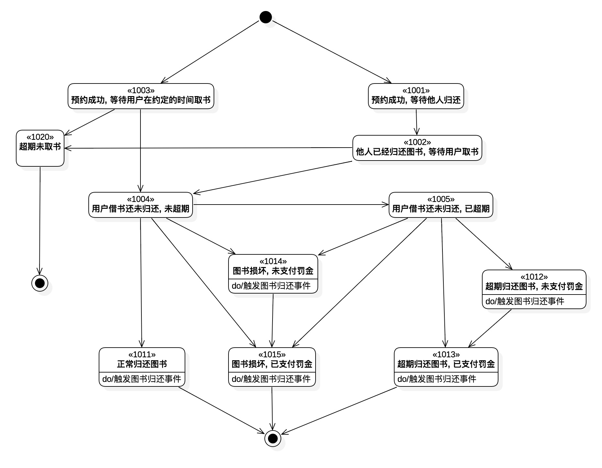

# 功能
## 介绍
本项目[小程序](#微信小程序)有 30 多个页面，实现了以下功能：

* 搜索图书
* 查看馆藏
* 在线预约/续借图书，线下扫码借书
* 创建/收藏/分享书单
* 书评功能
* 订单管理
* ...

其中**书单功能**与网易云音乐的歌单系统十分类似，用户可搜索、收藏、推荐和分享书单。用户不仅可为书单添加描述，还可以与书单内的每一本图书添加个性化描述。

[图书馆桌面应用](#图书馆桌面应用)、[超级管理员应用](#超级管理员应用)均为 vue 单页应用，具有订单管理、用户管理、数据可视化等功能。

[图书维基系统](#图书维基系统)也是 vue 单页应用。该系统结合维基百科与豆瓣图书的设计理念而开发，是一个开放、可供多人协同创作、且具有版本控制功能的图书信息管理系统。主要提供平台所使用的图书信息的协作管理功能，任何人均可浏览、创建和更改图书信息。

### 功能架构图

### 软件概览

各个软件功能请见下图：

## 运行截图
### 微信小程序

### 图书馆安卓App

### 图书馆桌面应用
#### 数据统计

### 图书维基系统
#### 登录注册

#### 搜索图书

#### 查看不同版本

#### 版本差异对比

### 超级管理员应用
#### 平台数据统计

## 用户身份

图书馆与读者是借阅关系，wiki系统贡献者能和其他用户共同维护图书信息。超级管理员管理所有的用户，同时接收他们意见反馈。

## 流程图

借书流程图：

订单状态转移图：

