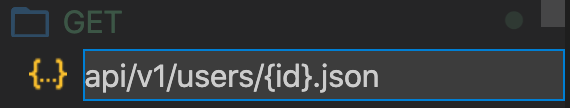

# Simplest Mock Server

Simplest Mock Server 是一个开箱即用的搭建本地 mock 接口的工具。支持 RESTful 占位符，支持 [mockjs](http://mockjs.com/)，提供基于请求的[动态化能力](#responsive)，可以轻松地[部署为在线服务](#wechat)。简单、轻量。

## 目录
- [安装与启动](#安装与启动)
- [配置接口](#配置接口)
  - [目录规范](#目录规范)
  - [新增接口](#新增接口)
  - [文件内容](#文件内容)
- [响应式数据](#响应式数据)
- [自定义 HTTP 状态码、Cookie、Header](#自定义-http-状态码cookieheader)
- [部署为在线服务](#部署为在线服务)
- [常见问题](#常见问题)
- [实际案例](#实际案例)


## 安装与启动

1. 准备环境：`node`(≥10.10.0)
3. 安装依赖：`npm install`
4. 启动服务：`gulp mock`
   * `--dir example`：接口配置目录
   * `--port 3000`：服务启动端口

如果在 mac 启动时报错：“无法打开 fse.node：来自身份不明的开发者“，请前往“系统设置 - 安全性与隐私 - 通用 - 允许从以下位置下载的 App”，点击“仍然允许“，然后再次执行 `gulp mock`。

## 配置接口

### 目录规范
Simplest Mock Server 使用 JSON 文件来描述每个接口的响应格式，所有 JSON 配置文件按照以下规范进行组织：
1. 使用一个*根目录*，管理所有接口配置文件
2. *根目录*下分为 `GET`、`POST`、`DELETE` 等多个*子目录*，代表不同的请求方法
3. 接口文件到*子目录*的相对路径，表示该接口在服务器上的路径

下面是一个接口配置目录的示例：

```
example                       // 根目录，名字可以自定义
├── GET                       // 所有 GET 接口配置
│   ├── api
│   │   └── v1
│   │       └── users
│   │           └── {id}.json // GET localhost:3000/api/v1/users/:id
│   └── users.json            // GET localhost:3000/users
├── POST                      // 所有 POST 接口配置
│   └── users.json            // POST localhost:3000/users
└── DELETE                    // 所有 DELETE 接口配置
    └── users
        └── {id}.json         // DELETE localhost:3000/users/:id
```

接口路径中的 *文件夹* 或 *JSON 文件名*可以是 RESTful 占位符，如：
* `api/v1/users/{id}.json`
* `api/v1/users/{id}/orders.json`

### 新增接口

新增接口时，只需遵循上述目录规范，创建一个 JSON 文件即可。

可以在 VS Code 中快速创建接口配置文件。在目录上“右键 - 新建文件”，然后输入完整路径：



### 文件内容

接口配置文件的内容必须是一个合法的 JSON 字符串，表示返回的响应内容。支持 [Mock.js](http://mockjs.com/examples.html) 的数据模板语法和数据占位符。以下是部分示例，详细用例请参考 [Mock.js 文档](http://mockjs.com/examples.html)。

[DELETE/users/{id}.json](example/DELETE/users/{id}.json)：
```json
{
  "message": "删除成功"
}
```

[GET/api/v1/users/{id}.json](example/GET/api/v1/users/{id}.json)：
```json
{
  "id": "@integer(60, 100)",
  "name": "@cname",
  "birthday": "@date",
  "address": "@city()",
  "postcode": "@zip"
}
```

请求结果：
```js
// 访问 http://localhost:3000/api/v1/users/1
{
  "id": 89,
  "name": "吴丽",
  "birthday": "2021-02-27",
  "address": "来宾市",
  "postcode": "371043"
}
```

[GET/users](example/GET/users.json)：
```json
{
  "users|1-10": [{
    "id": "@integer(60, 100)",
    "name": "@cname",
    "birthday": "@date",
    "address": "@city()",
    "postcode": "@zip"
  }]
}
```

请求结果：
```js
// 访问 http://localhost:3000/users
{
  "users": [
    {
      "id": 81,
      "name": "方芳",
      "birthday": "2007-11-24",
      "address": "铜陵市",
      "postcode": "326654"
    },
    {
      "id": 73,
      "name": "贺涛",
      "birthday": "1979-10-19",
      "address": "四平市",
      "postcode": "595462"
    },
    {
      "id": 66,
      "name": "姚磊",
      "birthday": "2002-09-15",
      "address": "天津市",
      "postcode": "712862"
    }
  ]
}
```

<div id="responsive"></div>

## 响应式数据

Mock.js 允许将某个属性的值设置为一个 `Function`（[文档](http://mockjs.com/examples.html#Function)）。本项目对此功能进行扩展，可以根据请求动态响应。

`Function` 的参数是一个对象，包含以下字段：
* `_req`：[express.Request](https://expressjs.com/zh-cn/api.html#req)
* `Mock`：Mock.js 对象

示例：[GET/echo.json](example/GET/echo.json)
```
{
  "headers": function ({ _req }) {
    return _req.headers;
  },
  "url": function ({ _req }) {
    return _req.url;
  },
  "query": function ({ _req }) {
    return _req.query;
  },
  "mock": function ({ Mock }) {
    return Mock.mock("@integer(60, 100)");
  }
}
```

请求结果：
```js
// 访问 http://localhost:3000/echo?param=123
{
  "headers": {
    "host": "localhost:3000",
    "connection": "keep-alive",
    "cache-control": "max-age=0",
    // ...
  },
  "url": "/echo?param=123",
  "query": { "param": "123" },
  "mock": 78
}
```

## 自定义 HTTP 状态码、Cookie、Header

通过 `_res` 属性可以自定义返回的响应。`_res` 属性包含以下字段：
* `status`：返回的状态码，默认 `200`
* `data`：可选，当 `status != 200` 时返回的内容

示例：
```json
{
  "success": true,
  "data": {
    "default": "hah"
  },
  "_res":{
    "status": 400,
    "data": {
      "success": false
    }
  }
}
```

返回内容为 `{ "success": false }`，状态码为 `400`。


[TODO]

`_res` 支持以下字段：
* [ ] `cookie`：`Object`
* [ ] `headers`：`Object`

<div id="wechat">

## 部署为在线服务

Simplest Mock Server 可以很轻松地部署为在线服务，如[微信云托管](https://developers.weixin.qq.com/miniprogram/dev/wxcloud/guide/container/guidance.html)、Google App Engine、[阿里云弹性容器实例](http://aliyun.com/product/eci)等各种基于容器的云服务。这种方式允许为多个应用提供在线 mock 接口，且成本极低。

以微信云托管服务为例，只需要按照[云托管文档](https://developers.weixin.qq.com/miniprogram/dev/wxcloud/guide/container/guidance.html)的流程创建服务，然后将 `simplest-mock-server` 文件夹上传即可。这种方式大大简化了微信小程序的开发工作流，可以在没有开发后端的情况下，向用户提供可在线预览的小程序版本。[weapp-library](https://github.com/imageslr/weapp-library) 提供了一个微信云托管的完整示例。

此仓库提供了微信云托管所需的 Dockerfile，其他云平台可自行更改。
## 常见问题

**支持不同的请求方法：**

只需要在*根目录*下新增*子目录*即可，*子目录*名字是 HTTP 请求方法的大写形式（例如 GET、PUT 或 POST）。

**支持 Mock.js 语法：**

见上文示例。详细用例请参考 [Mock.js 文档](http://mockjs.com/examples.html)。

**指定接口配置的根目录：**

可以在此仓库下，为不同的项目创建多个目录：
```
simplest-mock-server
├── example           // 示例项目的配置
├── project_a         // 项目 A 的配置
├── project_b         // 项目 B 的配置
├── gulpfile.js       // 启动入口
├── package.json
├── router.js
└── server.js
```

在启动 `gulp mock` 时，通过 `--dir` 参数可以指定接口配置的根目录：

```
gulp mock --dir project_a
```


**指定服务启动的端口号：**

启动 `gulp mock` 时，通过 `--port` 参数可以指定服务启动的端口号：

```
gulp mock --port 3001
```

## 实际案例

* [taro-library](https://github.com/imageslr/taro-library)：Taro + Redux 小程序示例项目，使用 Simplest Mock Server 提供本地 mock 接口。
* [weapp-library](https://github.com/imageslr/weapp-library)：包含 30+ 个页面的小程序项目，将 mock server 部署到微信云托管服务中，从而提供在线预览。